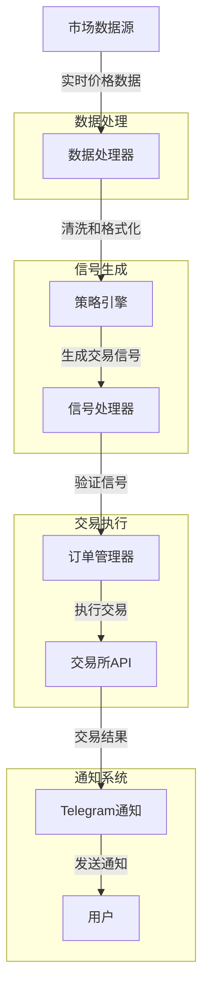

# 加密货币交易系统

一个功能完整的加密货币自动化交易系统，提供回测、优化和实盘交易功能，适合初学者和有经验的交易者使用。



## 系统架构

本系统采用模块化设计，由以下核心组件构成：

### 1. 市场数据模块
- **数据获取**：通过 `exchange_client.py` 和 `binance_client.py` 从交易所获取实时和历史数据
- **数据处理**：`data_processor.py` 负责清洗、规范化和特征工程

### 2. 策略引擎模块
- **信号生成**：`signals.py` 提供各种技术指标和交叉检测函数
- **策略实现**：`improved_strategy.py` 包含多种交易策略实现

### 3. 执行引擎模块
- **订单管理**：`broker.py` 处理订单创建、风险管理和仓位跟踪
- **交易执行**：`trading_loop.py` 实现交易循环逻辑

### 4. 回测与分析模块
- **回测引擎**：支持单一资产和投资组合回测
- **绩效分析**：计算关键绩效指标如夏普比率、最大回撤等

### 5. 通知与监控模块
- **Telegram通知**：实时发送交易信号和账户更新
- **日志记录**：记录交易活动和系统状态

## 核心文件功能说明

| 文件名 | 功能描述 |
|--------|---------|
| `src/signals.py` | 技术分析信号处理库，包含移动平均线、交叉检测等功能 |
| `src/broker.py` | 订单管理和风险控制，实现ATR止损和移动止损策略 |
| `src/data_processor.py` | 数据处理工具，提供数据清洗、特征工程等功能 |
| `src/improved_strategy.py` | 交易策略实现，包含MA交叉、RSI、布林带等策略 |
| `src/trading_loop.py` | 实时交易循环，处理信号检测和订单执行 |
| `src/exchange_client.py` | 交易所API接口抽象层，处理网络请求和错误重试 |
| `src/binance_client.py` | 币安交易所特定实现，处理币安API交互 |
| `src/market_simulator.py` | 市场模拟器，用于回测环境 |
| `src/telegram.py` | Telegram通知功能，发送交易信号和账户更新 |
| `live_trade.py` | 实盘交易入口程序 |
| `backtest.py` | 回测入口程序 |

## 策略原理与风险管理

### 交易策略
系统实现了多种常见的技术分析策略：

1. **移动平均线交叉策略**：基于快速MA上穿/下穿慢速MA生成买入/卖出信号
2. **RSI超买超卖策略**：利用相对强弱指数识别潜在反转点
3. **布林带突破策略**：基于价格突破布林带边界生成交易信号
4. **MACD策略**：利用MACD线与信号线交叉生成信号
5. **多时间框架策略**：综合多个时间周期的信号增强决策可靠性

### 风险管理与资金管理
系统实现了先进的风险控制机制：

1. **基于ATR的仓位计算**：根据波动率和账户风险百分比确定头寸大小
2. **智能止损策略**：
   - **初始止损**：基于ATR设置初始止损点
   - **移动止损**：基于R乘数(风险倍数)的三段式移动止损
   - **保本移动**：当利润达到初始风险1倍时移至保本
   - **跟踪移动**：当利润达到初始风险2倍时开始跟踪价格

## 安装与设置

### 1. 安装依赖
```bash
git clone https://github.com/yourusername/crypto-trading-system.git
cd crypto-trading-system
pip install -r requirements.txt
pip install -e .  # 安装为开发模式
```

### 2. 配置环境
创建配置文件 `config.ini`：
```ini
[BINANCE]
API_KEY = 你的API密钥
API_SECRET = 你的API密钥密文

[TRADING]
SYMBOL = BTC/USDT
QUANTITY = 0.001
RISK_PERCENT = 1
FAST_MA = 7
SLOW_MA = 25
ATR_PERIOD = 14
USE_TRAILING_STOP = true
```

### 3. 设置Telegram通知（可选）
```bash
export TG_TOKEN=your_telegram_bot_token
export TG_CHAT=your_chat_id
```

## 使用指南

### 运行回测
```bash
# 基本回测
python backtest.py --symbol BTC/USDT --start 2023-01-01 --end 2023-12-31

# 参数优化
python optimize_ma.py --symbol BTC/USDT
```

### 运行实盘交易
```bash
# 使用默认配置
python live_trade.py

# 使用自定义配置和交易周期
python live_trade.py --config my_config.ini --interval 4h
```

### 策略参数说明
- `fast_ma`：快速移动平均线周期（默认：7）
- `slow_ma`：慢速移动平均线周期（默认：25）
- `atr_period`：ATR计算周期（默认：14）
- `risk_percent`：每笔交易风险百分比（默认：1%）
- `breakeven_r`：移至保本位的盈亏比阈值（默认：1.0）
- `trail_r`：开始跟踪止损的盈亏比阈值（默认：2.0）

## 进阶功能

### 投资组合回测
系统支持多资产投资组合回测，可动态调整资产权重：
```bash
python backtest.py --portfolio --symbols BTC/USDT,ETH/USDT,SOL/USDT
```

### 自定义策略
您可以通过扩展 `improved_strategy.py` 模块实现自己的交易策略：
```python
def my_custom_strategy(data, param1, param2):
    signals = pd.DataFrame(index=data.index)
    signals["signal"] = 0
    
    # 实现您的策略逻辑
    # ...
    
    return signals
```

### 绩效分析与可视化
系统提供多种绩效分析工具：
```bash
# 绘制权益曲线
python plot_equity.py --result_file results.csv

# 比较不同策略
python plot_comparison.py --result_files result1.csv,result2.csv --labels strategy1,strategy2
```

## 生产环境注意事项

### 安全性
- 使用有限权限的API密钥（仅交易权限，无提款权限）
- 定期更换API密钥和密码
- 不要在公共代码库中存储敏感信息

### 稳定性
- 实现错误处理和恢复机制
- 设置合理的止损，避免重大亏损
- 监控系统资源使用情况
- 实施日志记录和警报系统

## 贡献与支持

欢迎通过以下方式贡献：
- 提交Bug报告
- 提出新功能建议
- 提交Pull Request

## 许可证

MIT

## 其他文档

- [Telegram通知详细文档](README_TELEGRAM.md)
- [网络请求框架文档](README_NETWORK.md)
- [测试网使用指南](README_TESTNET.md)
- [对账和分析工具](README_RECONCILIATION.md) 