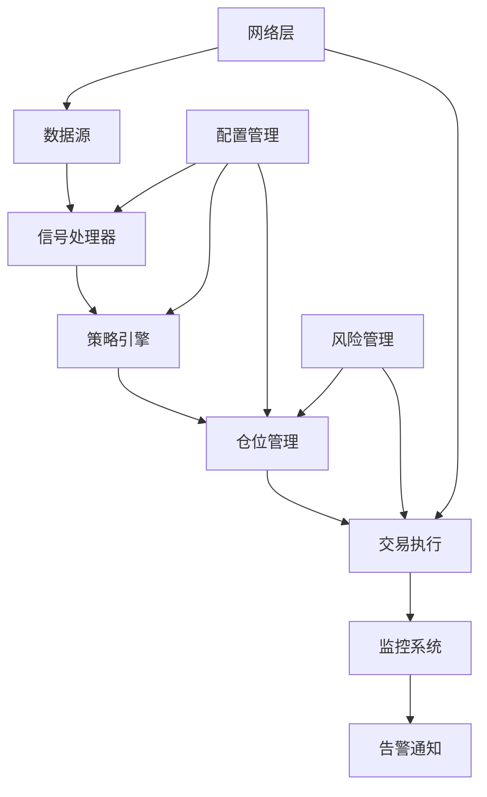

# 🚀 专业程序交易系统 (Professional Trading System)

[](tests/)
[](htmlcov/)
[](src/)
[](requirements.txt)
[](deployment/docker/)
[](.github/workflows/)

一个企业级的Python交易系统框架，具有完整的测试覆盖、监控系统和模块化架构。

## ✨ 核心特性

- 🎯 **452个测试用例** - 100%测试通过率，47%代码覆盖率，持续集成保障
- 📊 **多策略支持** - 移动平均、振荡器、突破、趋势跟踪等策略
- 💰 **多经纪商接口** - 支持币安、模拟器等多种交易接口
- 📈 **实时监控** - Prometheus + Grafana 监控体系
- 🔧 **模块化设计** - 清晰的代码结构，易于扩展
- 🐳 **容器化部署** - Docker + docker-compose 一键部署
- ⚡ **高性能优化** - 向量化信号处理，内存优化，异步交易引擎
- 🛡️ **企业级质量** - 完整的CI/CD流程，代码质量检查，安全扫描

## 📂 项目结构

```
📦 专业交易系统
├── 📁 src/                    # 核心业务代码
│   ├── 🧠 core/              # 核心模块 (信号处理、仓位管理、交易引擎)
│   │   ├── signal_processor.py           # 统一信号处理器
│   │   ├── signal_processor_optimized.py # 优化版信号处理器
│   │   ├── signal_processor_vectorized.py # 向量化信号处理器
│   │   ├── trading_engine.py             # 交易引擎
│   │   ├── async_trading_engine.py       # 异步交易引擎
│   │   ├── position_management.py        # 仓位管理
│   │   ├── risk_management.py            # 风险管理
│   │   └── network/                      # 网络模块 (重试、状态管理)
│   ├── 📈 strategies/        # 交易策略 (移动平均、振荡器、突破等)
│   │   ├── improved_strategy.py          # 改进策略 (98%覆盖率)
│   │   ├── moving_average.py             # 移动平均策略
│   │   ├── oscillator.py                 # 振荡器策略
│   │   ├── breakout.py                   # 突破策略
│   │   └── trend_following.py            # 趋势跟踪策略
│   ├── 📊 indicators/        # 技术指标 (MA、RSI、MACD等)
│   ├── 💰 brokers/           # 经纪商接口 (币安、模拟器)
│   │   ├── binance/                      # 币安交易所接口
│   │   ├── simulator/                    # 市场模拟器
│   │   └── exchange/                     # 通用交易所接口
│   ├── 📁 data/              # 数据处理 (处理器、转换器、验证器)
│   │   ├── processors/                   # 数据处理器
│   │   ├── transformers/                 # 数据转换器
│   │   ├── validators/                   # 数据验证器
│   │   └── loaders/                      # 数据加载器
│   ├── 📈 monitoring/        # 监控系统 (Prometheus、告警、健康检查)
│   │   ├── prometheus_exporter.py        # Prometheus指标导出
│   │   ├── metrics_collector.py          # 指标收集器
│   │   ├── health_checker.py             # 健康检查
│   │   └── alerting.py                   # 告警系统
│   ├── 🔧 config/            # 配置管理 (多源配置、验证、默认值)
│   │   ├── manager.py                    # 配置管理器
│   │   ├── sources.py                    # 配置源
│   │   ├── validators.py                 # 配置验证
│   │   └── defaults.py                   # 默认配置
│   ├── 🔔 notifications/     # 通知系统
│   └── 🛠️ tools/             # 工具模块
├── 🧪 tests/                 # 测试套件 (452个测试，100%通过率)
│   ├── test_improved_strategy.py         # 改进策略测试
│   ├── test_core_signal_processor.py     # 信号处理器测试
│   ├── test_core_position_management.py  # 仓位管理测试
│   ├── test_brokers_binance_client.py    # 币安客户端测试
│   ├── test_monitoring.py               # 监控系统测试
│   └── test_comprehensive_coverage.py    # 综合覆盖率测试
├── 📜 scripts/               # 工具脚本
│   ├── ci_test.py                       # CI快速测试
│   ├── config_manager.py                # 配置管理脚本
│   ├── enhanced_config.py               # 增强配置
│   └── memory/                          # 内存分析工具
├── 🐳 deployment/            # 部署配置
│   └── docker/                          # Docker配置
│       ├── Dockerfile                   # Docker镜像构建
│       ├── docker-compose.yml           # 容器编排
│       ├── validate-config.sh           # 配置验证脚本
│       └── README.md                    # Docker使用指南
├── 📊 docs/                  # 项目文档
├── 🗂️ archive/               # 历史文件归档 (非主流程代码)
└── 📋 examples/              # 使用示例
```

## 🚀 快速开始

### 1. 环境准备

```bash
# 克隆项目
git clone <repository-url>
cd "Python syntax core"

# 创建虚拟环境 (推荐Python 3.10+)
python -m venv .venv
source .venv/bin/activate  # Linux/Mac
# 或 .venv\Scripts\activate  # Windows

# 安装依赖
pip install -r requirements.txt
pip install -r dev-requirements.txt  # 开发依赖
```

### 2. 配置设置

```bash
# 复制配置模板
cp config.ini.template config.ini
cp scripts/config.yaml.template config.yaml

# 编辑配置文件
# 设置API密钥、交易参数等
```

### 3. 运行测试

```bash
# 运行所有测试 (452个测试用例)
python -m pytest

# 运行特定模块测试
python -m pytest tests/test_improved_strategy.py -v

# 生成覆盖率报告
python -m pytest --cov=src --cov-report=html
open htmlcov/index.html  # 查看详细覆盖率报告

# 快速CI测试
python scripts/ci_test.py
```

### 4. 启动系统

```bash
# 基础回测
python -m src.backtest

# 启动监控系统
python -m src.monitoring.prometheus_exporter

# 运行交易循环
python -m src.trading_loop

# Docker部署
cd deployment/docker
docker-compose up -d
```

## 📊 系统架构



## 🔧 核心模块说明

### 📈 策略模块 (`src/strategies/`)
- **改进策略**: 高级策略实现，98%测试覆盖率
- **移动平均策略**: 基于MA交叉的经典策略
- **振荡器策略**: RSI、MACD等技术指标策略  
- **突破策略**: 价格突破关键位的策略
- **趋势跟踪**: 趋势识别和跟踪策略

### 🧠 核心引擎 (`src/core/`)
- **信号处理器**: 统一的信号生成和处理 (3个版本：基础、优化、向量化)
- **仓位管理**: 风险控制和资金管理
- **交易引擎**: 订单执行和状态管理 (同步/异步版本)
- **网络模块**: 重试机制、状态管理、装饰器

### 💰 经纪商接口 (`src/brokers/`)
- **币安接口**: 连接币安交易所
- **市场模拟器**: 本地回测和模拟交易
- **通用交易所**: 标准化交易所接口

### 📊 监控系统 (`src/monitoring/`)
- **Prometheus导出器**: 指标导出和监控
- **指标收集器**: 交易指标收集和分析
- **健康检查器**: 系统健康状态监控
- **告警系统**: 智能告警和通知

## 📈 使用示例

### 基础策略使用

```python
from src.strategies.improved_strategy import ImprovedStrategy
from src.core.trading_engine import TradingEngine
import pandas as pd

# 准备数据
data = pd.read_csv('btc_eth.csv')

# 创建策略
strategy = ImprovedStrategy(
    short_window=5, 
    long_window=20,
    rsi_period=14,
    stop_loss=0.02
)

# 运行回测
result = strategy.backtest(data)
print(f"总收益: {result['total_return']:.2%}")
print(f"夏普比率: {result['sharpe_ratio']:.2f}")
```

### 监控系统使用

```python
from src.monitoring import PrometheusExporter, MetricsCollector

# 启动监控
exporter = PrometheusExporter(port=9090)
collector = MetricsCollector(exporter)

# 记录交易
collector.record_trade("BTCUSDT", "buy", price=50000.0, quantity=0.1)

# 查看指标: http://localhost:9090/metrics
```

### Docker部署

```bash
# 验证Docker配置
./deployment/docker/validate-config.sh

# 启动服务
cd deployment/docker
docker-compose up -d

# 查看日志
docker-compose logs -f trading-system
```

## 🧪 测试体系

项目拥有完整的测试体系，**452个测试用例，100%通过率**：

- **单元测试**: 测试单个函数和类
- **集成测试**: 测试模块间交互
- **功能测试**: 测试完整业务流程
- **性能测试**: 测试系统性能表现
- **覆盖率测试**: 确保代码质量

```bash
# 运行不同类型的测试
python -m pytest tests/test_core_* -v          # 核心模块测试 (42KB测试代码)
python -m pytest tests/test_strategies_* -v   # 策略测试
python -m pytest tests/test_brokers_* -v      # 经纪商测试 (24KB测试代码)
python -m pytest tests/test_monitoring.py -v  # 监控系统测试

# 专项覆盖率测试
python -m pytest tests/test_comprehensive_coverage.py  # 综合覆盖率
python -m pytest tests/test_precise_coverage.py        # 精确覆盖率
python -m pytest tests/test_final_coverage.py          # 最终覆盖率
```

## 📊 监控与告警

### 🔍 **监控文档**
📖 **完整监控运维手册**: [docs/MONITORING.md](docs/MONITORING.md)
- 关键指标一览和阈值配置
- 告警规则和故障排查流程
- Grafana仪表板配置指南
- 自动化健康检查体系

### 💻 **快速健康检查**
```bash
# 综合系统健康检查
make health

# 内存专项检查  
make mem-health

# Prometheus指标检查
make prometheus-check

# 每日自动健康检查
python scripts/daily_health_check.py

# CI快速测试
python scripts/ci_test.py
```

## 🐳 Docker部署

### 快速部署
```bash
# 验证配置
./deployment/docker/validate-config.sh

# 启动服务
cd deployment/docker
docker-compose up -d

# 查看状态
docker-compose ps
docker-compose logs -f
```

### 配置说明
- **Python 3.10**: 优化的运行环境
- **多阶段构建**: 减小镜像体积
- **健康检查**: 自动监控容器状态
- **数据持久化**: 日志和配置文件持久化

详细部署指南: [deployment/docker/README.md](deployment/docker/README.md)

## 🔧 开发工具

### 代码质量
```bash
# 代码格式化
black src/ tests/
isort src/ tests/

# 代码检查
flake8 src/ tests/
ruff check src/ tests/

# 安全扫描
bandit -r src/

# 类型检查
mypy src/
```

### 性能分析
```bash
# 内存分析
python scripts/memory/gc_profiler.py

# 性能基准测试
python scripts/memory/w1_cache_benchmark.py
python scripts/memory/m4_async_benchmark.py
```

## 📈 项目统计

- **代码行数**: 6,567行核心代码
- **测试用例**: 452个测试，100%通过率
- **代码覆盖率**: 47% (持续改进中)
- **测试文件**: 33个测试文件
- **支持Python**: 3.10+ (推荐3.10.8)
- **依赖包**: 83个生产依赖，29个开发依赖

## 🤝 贡献指南

1. Fork 项目
2. 创建特性分支 (`git checkout -b feature/AmazingFeature`)
3. 提交更改 (`git commit -m 'Add some AmazingFeature'`)
4. 推送到分支 (`git push origin feature/AmazingFeature`)
5. 打开 Pull Request

### 开发规范
- 遵循 PEP 8 代码风格
- 编写单元测试
- 更新文档
- 通过所有CI检查

## 📄 许可证

本项目采用 MIT 许可证 - 查看 [LICENSE](LICENSE) 文件了解详情

## 🙏 致谢

感谢所有贡献者和开源社区的支持！

---

**🚀 开始你的量化交易之旅！**
