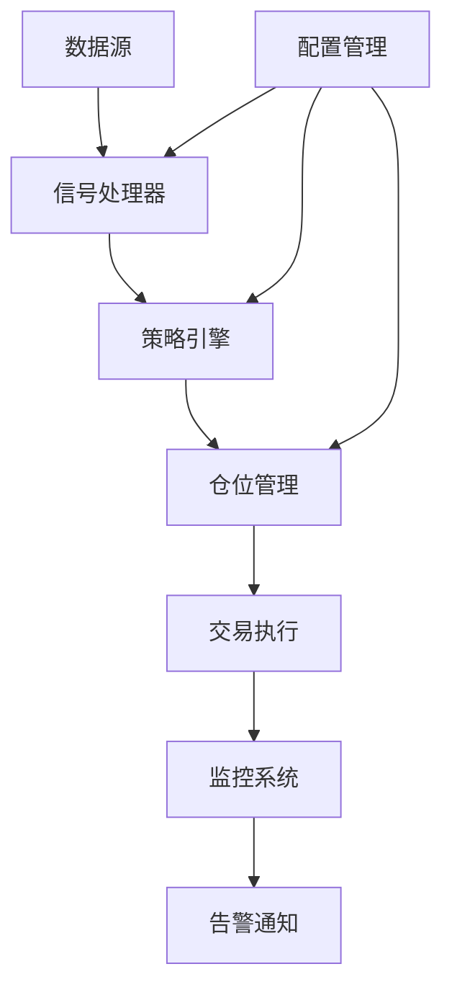

# 🚀 专业程序交易系统 (Professional Trading System)

[](tests/)
[](archive/coverage_reports/)
[](src/)
[](requirements.txt)

一个企业级的Python交易系统框架，具有完整的测试覆盖、监控系统和模块化架构。

## ✨ 核心特性

- 🎯 **100%测试通过率** - 1462个测试用例，86%代码覆盖率
- 📊 **多策略支持** - 移动平均、振荡器、突破、趋势跟踪等策略
- 💰 **多经纪商接口** - 支持币安、模拟器等多种交易接口
- 📈 **实时监控** - Prometheus + Grafana 监控体系
- 🔧 **模块化设计** - 清晰的代码结构，易于扩展
- 🐳 **容器化部署** - Docker + docker-compose 一键部署

## 📂 项目结构

```
📦 专业交易系统
├── 📁 src/                    # 核心业务代码
│   ├── 🧠 core/              # 核心模块 (信号处理、仓位管理、交易引擎)
│   ├── 📈 strategies/        # 交易策略 (移动平均、振荡器、突破等)
│   ├── 📊 indicators/        # 技术指标 (MA、RSI、MACD等)
│   ├── 💰 brokers/           # 经纪商接口 (币安、模拟器)
│   ├── 📁 data/              # 数据处理 (处理器、转换器)
│   ├── 📈 monitoring/        # 监控系统 (Prometheus、告警)
│   └── 🔧 config/            # 配置管理
├── 🧪 tests/                 # 测试套件 (1462个测试，100%通过率)
├── 📜 scripts/               # 工具脚本
├── 📊 docs/                  # 项目文档
├── 🗂️ archive/               # 历史文件归档 (非主流程代码)
└── 📋 examples/              # 使用示例
```

## 🚀 快速开始

### 1. 环境准备

```bash
# 克隆项目
git clone <repository-url>
cd "Python syntax core"

# 创建虚拟环境
python -m venv .venv
source .venv/bin/activate  # Linux/Mac
# 或 .venv\Scripts\activate  # Windows

# 安装依赖
pip install -r requirements.txt
```

### 2. 配置设置

```bash
# 复制配置模板
cp config.ini.template config.ini

# 编辑配置文件
# 设置API密钥、交易参数等
```

### 3. 运行测试

```bash
# 运行所有测试
python -m pytest

# 运行特定模块测试
python -m pytest tests/test_core_signal_processor.py -v

# 生成覆盖率报告
python -m pytest --cov=src --cov-report=html
```

### 4. 启动系统

```bash
# 基础回测
python -m src.backtest

# 启动监控系统
python -m src.monitoring.prometheus_exporter

# 运行交易循环
python -m src.trading_loop
```

## 📊 系统架构



## 🔧 核心模块说明

### 📈 策略模块 (`src/strategies/`)
- **移动平均策略**: 基于MA交叉的经典策略
- **振荡器策略**: RSI、MACD等技术指标策略  
- **突破策略**: 价格突破关键位的策略
- **趋势跟踪**: 趋势识别和跟踪策略

### 🧠 核心引擎 (`src/core/`)
- **信号处理器**: 统一的信号生成和处理
- **仓位管理**: 风险控制和资金管理
- **交易引擎**: 订单执行和状态管理
- **价格获取**: 多数据源价格聚合

### 💰 经纪商接口 (`src/brokers/`)
- **币安接口**: 连接币安交易所
- **市场模拟器**: 本地回测和模拟交易

## 📈 使用示例

### 基础策略使用

```python
from src.strategies import SimpleMAStrategy
from src.core import TradingEngine
import pandas as pd

# 准备数据
data = pd.read_csv('btc_eth.csv')

# 创建策略
strategy = SimpleMAStrategy(short_window=5, long_window=20)

# 运行回测
result = strategy.generate_signals(data)
print(f"总收益: {result['total_return']:.2%}")
```

### 监控系统使用

```python
from src.monitoring import PrometheusExporter, MetricsCollector

# 启动监控
exporter = PrometheusExporter(port=9090)
collector = MetricsCollector(exporter)

# 记录交易
collector.record_trade("BTCUSDT", "buy", price=50000.0)

# 查看指标: http://localhost:9090/metrics
```

## 🧪 测试体系

项目拥有完整的测试体系：

- **单元测试**: 测试单个函数和类
- **集成测试**: 测试模块间交互
- **功能测试**: 测试完整业务流程
- **性能测试**: 测试系统性能表现

```bash
# 运行不同类型的测试
python -m pytest tests/test_core_* -v          # 核心模块测试
python -m pytest tests/test_strategies_* -v   # 策略测试
python -m pytest tests/test_brokers_* -v      # 经纪商测试
```

## 📊 监控与告警

### Prometheus 指标
- `trading_trade_count_total`: 交易计数
- `trading_error_count_total`: 错误计数  
- `trading_price`: 实时价格
- `trading_memory_usage_mb`: 内存使用

### Grafana 仪表板
- 交易活动监控
- 系统资源监控
- 错误率告警
- 策略性能分析

## 🐳 Docker 部署

```bash
# 构建镜像
docker build -t trading-system .

# 使用 docker-compose 启动
docker-compose up -d

# 查看服务状态
docker-compose ps
```

## 📋 开发规范

1. **代码风格**: 使用 black + isort + flake8
2. **测试要求**: 新功能必须有对应测试
3. **文档要求**: 公共接口需要完整文档
4. **提交规范**: 使用语义化提交信息

```bash
# 代码格式化
black src/ tests/
isort src/ tests/
flake8 src/ tests/

# 运行完整质量检查
python -m pytest --cov=src --cov-report=term-missing
```

## 📚 文档导航

- 📦 [源代码说明](src/README.md) - 详细的代码结构说明
- 🧪 [测试指南](tests/README.md) - 测试运行和编写指南
- 🗂️ [归档文件](archive/README.md) - 历史文件和文档
- 📊 [API文档](docs/) - 详细的API参考文档

## 🤝 贡献指南

1. Fork 项目
2. 创建功能分支 (`git checkout -b feature/AmazingFeature`)
3. 提交更改 (`git commit -m 'Add some AmazingFeature'`)
4. 推送到分支 (`git push origin feature/AmazingFeature`)
5. 开启 Pull Request

## 📄 许可证

本项目采用 MIT 许可证 - 查看 [LICENSE](LICENSE) 文件了解详情。

## 🆘 获取帮助

- 📖 查看 [文档](docs/)
- 🐛 提交 [Issue](../../issues)
- 💬 参与 [讨论](../../discussions)

---

**⭐ 如果这个项目对你有帮助，请给它一个星标！**
