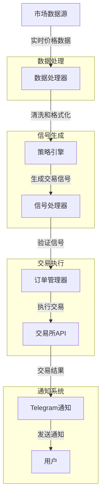

# 加密货币交易系统

一个功能完整的加密货币自动化交易系统，提供回测、优化和实盘交易功能，适合初学者和有经验的交易者使用。



## 系统架构

本系统采用模块化设计，由以下核心组件构成：

### 1. 市场数据模块
- **数据获取**：通过 `exchange_client.py` 和 `binance_client.py` 从交易所获取实时和历史数据
- **数据处理**：`data_processor.py` 负责清洗、规范化和特征工程

### 2. 策略引擎模块
- **信号生成**：`signals.py` 提供各种技术指标和交叉检测函数
- **策略实现**：`improved_strategy.py` 包含多种交易策略实现

### 3. 执行引擎模块
- **订单管理**：`broker.py` 处理订单创建、风险管理和仓位跟踪
- **交易执行**：`trading_loop.py` 实现交易循环逻辑

### 4. 回测与分析模块
- **回测引擎**：支持单一资产和投资组合回测
- **绩效分析**：计算关键绩效指标如夏普比率、最大回撤等

### 5. 通知与监控模块
- **Telegram通知**：实时发送交易信号和账户更新
- **日志记录**：记录交易活动和系统状态

## 核心文件功能说明

| 文件名 | 功能描述 |
|--------|---------|
| `src/signals.py` | 技术分析信号处理库，包含移动平均线、交叉检测等功能 |
| `src/broker.py` | 订单管理和风险控制，实现ATR止损和移动止损策略 |
| `src/data_processor.py` | 数据处理工具，提供数据清洗、特征工程等功能 |
| `src/improved_strategy.py` | 交易策略实现，包含MA交叉、RSI、布林带等策略 |
| `src/trading_loop.py` | 实时交易循环，处理信号检测和订单执行 |
| `src/exchange_client.py` | 交易所API接口抽象层，处理网络请求和错误重试 |
| `src/binance_client.py` | 币安交易所特定实现，处理币安API交互 |
| `src/market_simulator.py` | 市场模拟器，用于回测环境 |
| `src/telegram.py` | Telegram通知功能，发送交易信号和账户更新 |
| `live_trade.py` | 实盘交易入口程序 |
| `backtest.py` | 回测入口程序 |

## 策略原理与风险管理

### 交易策略
系统实现了多种常见的技术分析策略：

1. **移动平均线交叉策略**：基于快速MA上穿/下穿慢速MA生成买入/卖出信号
2. **RSI超买超卖策略**：利用相对强弱指数识别潜在反转点
3. **布林带突破策略**：基于价格突破布林带边界生成交易信号
4. **MACD策略**：利用MACD线与信号线交叉生成信号
5. **多时间框架策略**：综合多个时间周期的信号增强决策可靠性

### 风险管理与资金管理
系统实现了先进的风险控制机制：

1. **基于ATR的仓位计算**：根据波动率和账户风险百分比确定头寸大小
2. **智能止损策略**：
   - **初始止损**：基于ATR设置初始止损点
   - **移动止损**：基于R乘数(风险倍数)的三段式移动止损
   - **保本移动**：当利润达到初始风险1倍时移至保本
   - **跟踪移动**：当利润达到初始风险2倍时开始跟踪价格

## 安装与设置

### 1. 安装依赖
```bash
git clone https://github.com/yourusername/crypto-trading-system.git
cd crypto-trading-system
pip install -r requirements.txt
pip install -e .  # 安装为开发模式
```

### 2. 配置环境
创建配置文件 `config.ini`：
```ini
[BINANCE]
API_KEY = 你的API密钥
API_SECRET = 你的API密钥密文

[TRADING]
SYMBOL = BTC/USDT
QUANTITY = 0.001
RISK_PERCENT = 1
FAST_MA = 7
SLOW_MA = 25
ATR_PERIOD = 14
USE_TRAILING_STOP = true
```

### 3. 设置Telegram通知（可选）
```bash
export TG_TOKEN=your_telegram_bot_token
export TG_CHAT=your_chat_id
```

## 使用指南

### 运行回测
```bash
# 基本回测
python backtest.py --symbol BTC/USDT --start 2023-01-01 --end 2023-12-31

# 参数优化
python optimize_ma.py --symbol BTC/USDT
```

### 运行实盘交易
```bash
# 使用默认配置
python live_trade.py

# 使用自定义配置和交易周期
python live_trade.py --config my_config.ini --interval 4h
```

### 策略参数说明
- `fast_ma`：快速移动平均线周期（默认：7）
- `slow_ma`：慢速移动平均线周期（默认：25）
- `atr_period`：ATR计算周期（默认：14）
- `risk_percent`：每笔交易风险百分比（默认：1%）
- `breakeven_r`：移至保本位的盈亏比阈值（默认：1.0）
- `trail_r`：开始跟踪止损的盈亏比阈值（默认：2.0）

## 进阶功能

### 投资组合回测
系统支持多资产投资组合回测，可动态调整资产权重：
```bash
python backtest.py --portfolio --symbols BTC/USDT,ETH/USDT,SOL/USDT
```

### 自定义策略
您可以通过扩展 `improved_strategy.py` 模块实现自己的交易策略：
```python
def my_custom_strategy(data, param1, param2):
    signals = pd.DataFrame(index=data.index)
    signals["signal"] = 0
    
    # 实现您的策略逻辑
    # ...
    
    return signals
```

### 绩效分析与可视化
系统提供多种绩效分析工具：
```bash
# 绘制权益曲线
python plot_equity.py --result_file results.csv

# 比较不同策略
python plot_comparison.py --result_files result1.csv,result2.csv --labels strategy1,strategy2
```

## 生产环境注意事项

### 安全性
- 使用有限权限的API密钥（仅交易权限，无提款权限）
- 定期更换API密钥和密码
- 不要在公共代码库中存储敏感信息

### 稳定性
- 实现错误处理和恢复机制
- 设置合理的止损，避免重大亏损
- 监控系统资源使用情况
- 实施日志记录和警报系统

## 贡献与支持

欢迎通过以下方式贡献：
- 提交Bug报告
- 提出新功能建议
- 提交Pull Request

## 许可证

MIT

## 其他文档

- [Telegram通知详细文档](README_TELEGRAM.md)
- [网络请求框架文档](README_NETWORK.md)
- [测试网使用指南](README_TESTNET.md)
- [对账和分析工具](README_RECONCILIATION.md) 

## 仓库详细文件说明

以下是本仓库中主要文件和目录的详细解释，帮助初学者快速了解系统结构。

### 主目录文件

1. **README.md** (6.3KB)
   - 项目主文档，包含系统架构说明、安装步骤和使用指南
   - 提供了整个系统的概览和功能说明

2. **requirements.txt** (216B)
   - 项目依赖包列表，包括pandas、numpy、matplotlib等核心库
   - 运行系统所需的外部依赖

3. **live_trade.py** (11KB)
   - 实盘交易主程序，系统的入口点
   - 包含配置加载、客户端初始化和策略执行函数

4. **backtest.py** (3.2KB)
   - 回测引擎主程序，用于测试策略在历史数据上的表现
   - 包含数据加载、策略执行和性能指标计算功能

5. **improved_strategy.py** (8.4KB)
   - 改进的交易策略实现，包含多种技术分析策略
   - 实现了MA交叉、RSI超买超卖等交易信号

6. **fetch_binance.py** (4.9KB)
   - 从币安交易所获取历史和实时数据的工具
   - 支持多种交易对和时间周期

7. **reconcile.py** (2.9KB)
   - 交易对账工具，用于核对交易记录和实际成交
   - 支持生成对账报告和发送通知

8. **load_env.py** (2.8KB)
   - 环境变量加载工具，处理配置文件和环境变量
   - 用于系统初始化和配置管理

9. **data.py** (1.3KB)
   - 数据加载工具，用于从CSV文件加载价格数据
   - 支持多资产数据处理

10. **is_prime.py** (1.1KB)
    - 质数判断算法的Python实现
    - 用于演示和教学目的

11. **optimize_ma.py** (1.0KB)
    - 移动平均策略参数优化工具
    - 寻找最优交易参数组合

12. **run_full_test.py** (801B)
    - 完整系统测试工具，运行所有单元测试
    - 用于质量保证和回归测试

13. **plot_comparison.py**, **plot_equity.py**, **plot_portfolio.py** (约1KB每个)
    - 结果可视化工具，绘制权益曲线和性能比较图
    - 支持多策略和多资产的可视化比较

14. **config.ini.template** (575B)
    - 配置文件模板，包含API密钥和交易参数
    - 用于用户自定义系统配置

### src 目录 (核心功能模块)

1. **signals.py** (6.4KB)
   - 技术分析信号处理模块
   - 包含移动平均、布林带、交叉检测等指标计算函数
   - 支持向量化操作，提高计算效率

2. **broker.py** (32KB)
   - 订单管理和风险控制核心模块
   - 实现ATR止损、移动止损和仓位管理
   - 包含单资产和投资组合回测功能

3. **data_processor.py** (9.6KB)
   - 数据处理工具，清洗和规范化价格数据
   - 支持特征工程和时间序列处理

4. **trading_loop.py** (9.7KB)
   - 实时交易循环实现，处理信号检测和订单执行
   - 支持定时执行和异常处理

5. **market_simulator.py** (15KB)
   - 市场模拟器，用于回测环境
   - 模拟订单执行和市场行为

6. **improved_strategy.py** (12KB)
   - 高级交易策略实现，多种技术分析组合
   - 支持多时间周期分析和信号过滤

7. **exchange_client.py** (12KB)
   - 交易所API接口抽象层
   - 处理网络请求和错误重试

8. **binance_client.py** (9.3KB)
   - 币安交易所特定实现
   - 处理币安API交互和响应解析

9. **network.py** (14KB)
   - 网络请求框架，处理API调用和重试逻辑
   - 实现错误处理和请求限流

10. **telegram.py** (1.9KB)
    - Telegram通知功能实现
    - 发送交易信号和账户更新

11. **notify.py** (3.0KB)
    - 通用通知系统，支持多种通知渠道
    - 处理消息格式化和发送

12. **utils.py** (1.6KB)
    - 实用工具函数集合
    - 包含路径处理、日期格式化等功能

13. **metrics.py** (937B)
    - 性能指标计算模块
    - 计算夏普比率、最大回撤等评估指标

14. **portfolio_backtest.py** (732B)
    - 投资组合回测专用模块
    - 支持多资产权重优化

### tests 目录 (测试模块)

1. **test_signals.py**, **test_broker.py**, **test_metrics.py** 等
   - 单元测试模块，验证各功能正确性
   - 采用pytest框架编写的详细测试用例

2. **test_snapshots.py** (5.7KB)
   - 快照测试，确保系统行为一致性
   - 用于回归测试和质量保证

### examples 目录

1. **retry_example.py** (5.2KB)
   - 网络请求重试机制示例代码
   - 演示错误处理和恢复策略

### 配置文件

1. **.flake8**, **pyproject.toml**
   - Python代码风格和测试配置
   - 确保代码质量和一致性

2. **setup.py** (717B)
   - 包安装配置，定义项目依赖和元数据
   - 支持pip安装和开发模式

## 功能模块详解

### 1. 信号生成模块 (src/signals.py)

该模块实现了各种技术分析指标计算:
- 移动平均线(MA)计算：支持SMA、EMA、WMA不同类型
- 交叉检测：快速实现上穿/下穿信号
- 布林带、Z-score、变化率等指标
- 向量化计算，提高大数据处理效率

### 2. 订单管理模块 (src/broker.py)

订单和风险管理的核心实现:
- ATR止损计算：基于波动率设置合理止损
- 移动止损策略：三段式移动止损逻辑
- 仓位计算：基于账户风险比例和波动率
- 回测引擎：单资产和投资组合回测
- 订单执行和日志记录

### 3. 数据处理模块 (src/data_processor.py)

处理价格数据的关键功能:
- 数据清洗：处理缺失值和异常值
- 特征工程：计算技术指标作为特征
- 数据规范化：确保不同资产可比性
- 时间序列处理：重采样和对齐

### 4. 交易执行模块 (src/trading_loop.py)

实时交易的运行环境:
- 信号检测：监控市场数据产生信号
- 订单执行：处理买卖操作和错误情况
- 定时任务：按设定周期执行策略
- 异常处理：处理网络和API错误

### 5. 通知系统 (src/telegram.py, src/notify.py)

交易状态通知功能:
- Telegram机器人集成：发送实时交易通知
- 信号通知：发送买卖信号和理由
- 账户更新：定期发送权益和持仓报告
- 错误通知：关键错误的实时警报

### 6. 回测工具 (backtest.py, src/market_simulator.py)

策略评估和优化工具:
- 历史数据回测：模拟历史交易表现
- 市场模拟：模拟订单执行和滑点
- 性能指标：计算夏普比率、最大回撤等
- 参数优化：网格搜索最优参数组合

### 7. 实盘交易 (live_trade.py)

实盘交易的入口程序:
- 配置加载：读取API密钥和交易参数
- 交易循环：持续监控市场和执行订单
- 状态保存：记录持仓和交易历史
- 风险控制：实时调整止损和仓位

## 数据文件说明

1. **btc_eth.csv**, **btc_eth_2yr_20250428.csv** (20KB)
   - BTC和ETH历史价格数据
   - 用于策略回测和开发

2. **grid_results.csv** (14KB)
   - 参数优化网格搜索结果
   - 记录不同参数组合的性能

3. **trades.csv** (136B)
   - 交易记录文件，记录所有交易详情
   - 包含时间、价格、数量等信息

4. **position_state.json** (174B)
   - 持仓状态记录，保存当前交易状态
   - 用于程序重启后恢复交易状态

## 可视化文件

1. **strategy_improvement.png**, **price_comp.png** 等图像文件
   - 策略优化和比较的可视化结果
   - 展示不同策略和资产的性能对比

## 其他文档

1. **README_TELEGRAM.md**, **README_NETWORK.md** 等
   - 特定模块的详细说明文档
   - 包含使用指南和高级配置说明

2. **DEPENDENCIES.md** (1.2KB)
   - 详细的依赖列表和版本要求
   - 包含安装指南和兼容性说明

## 学习路径建议

对于初学者，建议按以下顺序学习本项目：

1. 首先了解基本概念：移动平均线、交叉信号等基础技术指标
2. 学习数据获取和处理：`fetch_binance.py`和`data_processor.py`
3. 了解简单策略：`signals.py`中的基本信号生成函数
4. 学习回测系统：使用`backtest.py`测试简单策略
5. 了解风险管理：学习`broker.py`中的止损和仓位管理
6. 进阶到复杂策略：研究`improved_strategy.py`中的多指标组合
7. 最后学习实盘交易：理解`live_trade.py`和`trading_loop.py`的工作原理

这一学习路径将帮助你从基础到进阶，逐步掌握自动化交易系统的开发和使用。 