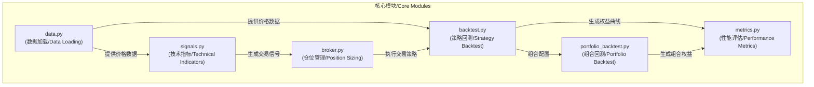

# Python Algorithmic Trading Framework



This repository contains a modular Python framework for backtesting algorithmic trading strategies, with a focus on moving average crossovers and risk-based position sizing. The architecture follows clean separation of concerns:

## Structure

- `src/data.py` - Data loading and API access (CSV, Binance)
- `src/signals.py` - Technical indicators and signal generation (MA, crossovers)
- `src/broker.py` - Position sizing and stop-loss logic
- `src/backtest.py` - Strategy orchestration and backtest runner
- `tests/` - Unit tests with pytest

## Getting Started

### Installation

```bash
# Option 1: Regular installation
pip install -r requirements.txt

# Option 2: Development installation (recommended for contributors)
pip install -e .                 # Install the package in development mode
pip install -r dev-requirements.txt  # Install development tools
```

### Running

```bash
# Run the backtest
python -c "from src.backtest import run_backtest; print(run_backtest().iloc[-1])"

# Run the tests
pytest
```

## Examples

### Simple Moving Average Demo
```python
from src import data, signals

df = data.load_csv()
sma_5 = signals.moving_average(df["btc"], 5)
print(sma_5.tail())
```

### Modern Signal Generation
```python
from src import data, signals
import matplotlib.pyplot as plt

# 加载价格数据
price = data.load_csv()["btc"]

# 计算快慢均线
fast_ma = signals.moving_average(price, 5)
slow_ma = signals.moving_average(price, 20)

# 生成交叉信号Series
buy_signals = signals.bullish_cross_series(fast_ma, slow_ma)
sell_signals = signals.bearish_cross_series(fast_ma, slow_ma)

# 仅提取有信号的点
buy_points = price[buy_signals]
sell_points = price[sell_signals]

# 输出买卖点数量
print(f"Buy signals: {len(buy_points)}, Sell signals: {len(sell_points)}")

# 绘制价格和信号
plt.figure(figsize=(12, 6))
plt.plot(price, label='Price')
plt.plot(fast_ma, label='Fast MA', alpha=0.7)
plt.plot(slow_ma, label='Slow MA', alpha=0.7)
plt.scatter(buy_points.index, buy_points, color='green', marker='^', label='Buy')
plt.scatter(sell_points.index, sell_points, color='red', marker='v', label='Sell')
plt.legend()
plt.title('Price with MA Crossover Signals')
plt.show()
```

### Strategy vs Buy & Hold
```python
import matplotlib.pyplot as plt
from src import data, backtest

# Load data and run strategy
price = data.load_csv()["btc"]
eq = backtest.run_backtest()
buy_hold = price / price.iloc[0] * eq.iloc[0]

# Plot comparison
plt.plot(eq, label="Strategy")
plt.plot(buy_hold, label="Buy & Hold")
plt.legend()
plt.title("Trading Strategy vs Buy & Hold")
plt.xlabel("Date")
plt.ylabel("Equity ($)")
plt.show()
``` 