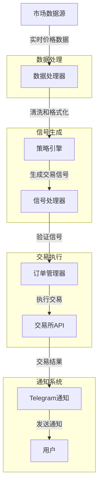

# 加密货币交易系统



这是一个自动化的加密货币交易系统，具有实时交易和Telegram通知功能。

## 主要功能

- 自动化交易执行
- 实时市场数据监控
- Telegram通知系统，发送交易信号和账户更新
- 可配置的交易策略
- 止损管理

## 安装

1. 克隆仓库
   ```bash
   git clone https://github.com/yourusername/crypto-trading-system.git
   cd crypto-trading-system
   ```

2. 安装依赖
   ```bash
   pip install -r requirements.txt
   ```

3. 配置系统（见下文）

## 配置

系统使用环境变量或`.env`文件进行配置。主要配置项包括：

- 交易所API凭证
- 交易参数（币对、数量等）
- Telegram通知设置（可选）

### Telegram通知配置

系统可以通过Telegram发送实时交易通知，包括买入/卖出信号和止损更新。

#### 设置步骤

1. **创建Telegram机器人**：
   - 在Telegram中搜索 `@BotFather`
   - 发送 `/newbot` 命令
   - 按照提示设置机器人名称和用户名
   - 获取API令牌(Token)

2. **获取聊天ID**：
   - 向你的机器人发送消息
   - 访问 `https://api.telegram.org/bot<YourBOTToken>/getUpdates`
   - 找到 `chat` 对象中的 `id` 字段

3. **配置系统**：

   可以通过以下方式之一配置Telegram通知：

   - 使用命令行工具：
     ```bash
     python load_env.py --tg_token=YOUR_TOKEN --tg_chat=YOUR_CHAT_ID --save
     ```

   - 直接编辑.env文件，添加：
     ```
     TG_TOKEN=your_telegram_bot_token
     TG_CHAT=your_chat_id
     ```

   - 设置环境变量：
     ```bash
     export TG_TOKEN=your_telegram_bot_token
     export TG_CHAT=your_chat_id
     ```

4. **测试配置**：
   ```bash
   python test_telegram.py
   ```

#### 通知格式示例

系统会发送以下格式的通知：

- **买入信号**:
  ```
  🟢 买入信号
  0.123 BTC @ 50123.45 USDT
  止损价: 49500.00 USDT
  账户余额: 12345.67 USDT
  ```

- **止损更新**:
  ```
  🔶 止损更新
  0.123 BTC 持仓
  新止损价: 49800.00 USDT
  账户余额: 12345.67 USDT
  ```

- **卖出信号**:
  ```
  🔴 卖出信号
  0.123 BTC @ 51234.56 USDT
  账户余额: 12678.90 USDT
  ```

更多详细信息，请参阅 [Telegram通知文档](README_TELEGRAM.md)。

## 使用方法

### 启动实时交易

```bash
python live_trade.py
```

### 命令行参数

```
--config      配置文件路径(可选)
--pair        交易对(例如 BTC/USDT)
--qty         交易数量
--exchange    交易所名称
```

## 安全注意事项

- 永远不要共享你的API密钥或Telegram令牌
- 考虑对机器人使用受限API密钥，仅具有交易权限而无提款权限
- 定期检查和更新权限

## 贡献

欢迎贡献！请提交问题或拉取请求。

## 许可证

MIT 