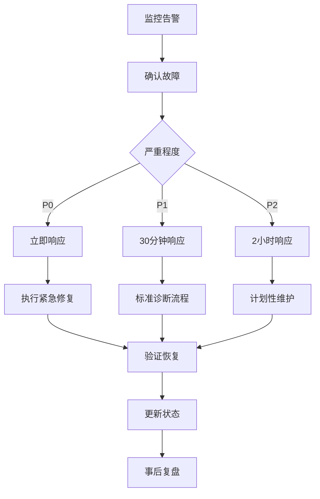

# 🚨 M4异步交易系统故障处理手册
# M4 Async Trading System Incident Response Runbook

## 🎯 概述

本手册涵盖M4阶段异步交易系统的故障诊断和应急处理程序。

**紧急联系信息**:
- 值班工程师: [配置联系方式]
- 系统管理员: [配置联系方式]
- 监控告警: Prometheus + Grafana

---

## 📊 故障分类与响应

### 🔴 P0 - 严重故障 (立即响应)

#### WS_HEARTBEAT_MISSED - WebSocket心跳丢失
**症状**: WebSocket连接断开，实时行情中断

**诊断步骤**:
```bash
# 1. 检查WebSocket连接状态
curl http://localhost:8000/metrics | grep ws_connections_total

# 2. 查看最近的重连记录
curl http://localhost:8000/metrics | grep ws_reconnects_total

# 3. 检查网络连接
ping stream.binance.com
```

**修复步骤**:
```bash
# 步骤1: 手动重启WebSocket连接
make restart-ws

# 步骤2: 检查恢复状态 (等待30秒)
sleep 30
curl http://localhost:8000/metrics | grep ws_connections_total

# 步骤3: 如果仍然失败，切换到REST模式
make fallback-rest
```

**升级条件**: 5分钟内无法恢复 → 联系值班工程师

---

#### ASYNC_TASK_OVERRUN - 异步任务堆积
**症状**: 任务延迟激增，P95 > 1秒

**诊断步骤**:
```bash
# 1. 检查任务队列积压
curl http://localhost:8000/metrics | grep concurrent_tasks_active

# 2. 查看任务延迟分布
curl http://localhost:8000/metrics | grep task_latency_seconds

# 3. 检查CPU和内存使用
top -p $(pgrep -f async_trading_engine)
```

**修复步骤**:
```bash
# 步骤1: 临时减少交易对数量
export TRADING_PAIRS="BTCUSDT"  # 只保留主要交易对

# 步骤2: 重启交易引擎
sudo systemctl restart trading-engine

# 步骤3: 监控恢复情况
watch "curl -s http://localhost:8000/metrics | grep task_latency"
```

**升级条件**: 任务延迟持续 > 5分钟 → 触发熔断机制

---

### 🟡 P1 - 高优先级故障 (30分钟响应)

#### HIGH_LATENCY_SPIKE - 延迟突增
**症状**: P95延迟 > 200ms，但系统仍在运行

**诊断流程**:
1. 检查系统负载: `htop`
2. 查看网络延迟: `ping api.binance.com`
3. 分析慢查询: 检查数据库连接
4. 查看GC压力: `python -X tracemalloc`

**修复策略**:
- 临时降低数据处理频率
- 清理内存缓存
- 优化热点代码路径

---

#### ORDER_FAILURE_RATE_HIGH - 订单失败率高
**症状**: 订单成功率 < 90%

**诊断流程**:
1. 检查API限流状态
2. 验证账户余额和权限
3. 分析订单拒绝原因
4. 查看市场波动情况

**修复策略**:
- 降低订单频率
- 检查风控参数
- 联系交易所技术支持

---

### 🟢 P2 - 一般故障 (2小时响应)

#### MEMORY_LEAK_DETECTED - 内存泄漏
**症状**: 内存使用持续增长

**诊断步骤**:
```python
# 启用内存追踪
import tracemalloc
tracemalloc.start()

# 运行一段时间后检查
current, peak = tracemalloc.get_traced_memory()
print(f"Current: {current / 1024 / 1024:.1f} MB")
print(f"Peak: {peak / 1024 / 1024:.1f} MB")
```

**修复策略**:
- 定期重启服务
- 优化数据结构
- 设置内存限制

---

## 🛠️ 标准操作程序 (SOP)

### 故障响应流程



### 紧急命令参考

```bash
# 系统状态检查
make canary-status

# 性能监控
make monitor-canary

# 紧急回滚
make canary-rollback

# WebSocket重启
make restart-ws

# 切换REST模式
make fallback-rest

# 系统健康检查
curl http://localhost:8000/metrics | grep -E "(signal_latency|order_latency|ws_latency)"
```

---

## 📈 监控指标参考

### 关键阈值表

| 指标 | 正常范围 | 警告阈值 | 严重阈值 | 处理措施 |
|------|----------|----------|----------|----------|
| `binance_ws_latency_seconds` P95 | < 0.05s | > 0.1s | > 0.2s | 重启WebSocket |
| `task_latency_seconds` P95 | < 0.1s | > 0.2s | > 0.5s | 减少任务负载 |
| `order_roundtrip_latency_seconds` P95 | < 0.5s | > 1.0s | > 2.0s | 检查API连接 |
| `concurrent_tasks_active` | < 10 | > 20 | > 50 | 限制并发数 |
| `ws_reconnects_total` 增长率 | < 1/hour | > 5/hour | > 20/hour | 网络诊断 |

### 监控查询样例

```bash
# WebSocket健康检查
curl -s http://localhost:8000/metrics | grep "ws_connections_total{status=\"success\"}"

# 任务延迟分布
curl -s http://localhost:8000/metrics | grep "task_latency_seconds_bucket"

# 订单成功率
curl -s http://localhost:8000/metrics | grep "order_" | grep "total"
```

---

## 🔧 故障预防检查清单

### 日常检查 (每日)
- [ ] 检查系统资源使用率 (CPU < 70%, 内存 < 80%)
- [ ] 验证WebSocket连接稳定性
- [ ] 查看异常日志数量
- [ ] 检查订单成功率趋势

### 周度检查 (每周)
- [ ] 运行完整性能基准测试
- [ ] 检查内存泄漏趋势
- [ ] 更新依赖版本
- [ ] 备份配置文件

### 月度检查 (每月)
- [ ] 容量规划评估
- [ ] 灾难恢复演练
- [ ] 监控告警规则优化
- [ ] 文档更新和培训

---

## 📞 升级和通知

### 升级矩阵

| 故障类型 | 持续时间 | 影响范围 | 升级对象 |
|----------|----------|----------|----------|
| WebSocket断开 | > 5分钟 | 实时数据中断 | 值班工程师 |
| 订单执行失败 | > 10分钟 | 交易功能异常 | 系统管理员 |
| 性能严重劣化 | > 15分钟 | 用户体验下降 | 技术负责人 |

### 通知模板

```yaml
故障通知:
  标题: "[P0] M4系统WebSocket连接异常"
  内容: |
    - 故障时间: 2024-XX-XX XX:XX:XX
    - 影响范围: 实时行情数据中断
    - 当前状态: 正在处理
    - 预计恢复: XX分钟
    - 负责人员: [姓名]
```

---

## 📝 事后复盘模板

```markdown
## 故障复盘报告

### 基本信息
- 故障时间: 
- 影响时长: 
- 严重等级: 
- 负责人员: 

### 故障描述
- 故障现象: 
- 用户影响: 
- 业务损失: 

### 根因分析
- 直接原因: 
- 根本原因: 
- 时间线: 

### 修复措施
- 临时措施: 
- 永久修复: 
- 验证结果: 

### 改进建议
- 监控优化: 
- 流程改进: 
- 技术升级: 

### 行动计划
- [ ] 短期行动 (1周内)
- [ ] 中期行动 (1月内)  
- [ ] 长期行动 (1季度内)
```

---

## 🎯 快速诊断决策树

```
系统异常？
├── 是否WebSocket相关？
│   ├── 是 → 检查网络 → 重启WS → 切换REST
│   └── 否 → 继续诊断
├── 是否性能问题？
│   ├── 是 → 检查CPU/内存 → 减负 → 重启
│   └── 否 → 继续诊断
├── 是否订单问题？
│   ├── 是 → 检查API → 验证权限 → 降频
│   └── 否 → 升级处理
```

---

**最后更新**: 2024-12-20  
**下次审查**: 2025-01-20  
**维护者**: M4 Development Team 